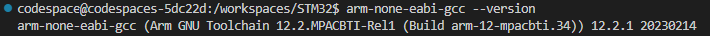

# To build source code on Codespace Github, you need a toolchain and GNU MAKE.

* Because the Codespace had GNU MAKE, you didn't need install GNU MAKE. 
* In this project, I build source code for microcontroller STM32 so I need ARM GNU Toolchain.

## Install ARM GNU Toolchain on Codespace

### 1. Determine the latest version of the toolchain via the command line:

    ARM_TOOLCHAIN_VERSION=$(curl -s https://developer.arm.com/downloads/-/arm-gnu-toolchain-downloads | grep -Po '<h4>Version \K.+(?=</h4>)')
    
### 2. Download the archive file from the official website:

    curl -Lo gcc-arm-none-eabi.tar.xz "https://developer.arm.com/-/media/Files/downloads/gnu/${ARM_TOOLCHAIN_VERSION}/binrel/arm-gnu-toolchain-${ARM_TOOLCHAIN_VERSION}-x86_64-arm-none-eabi.tar.xz"

### 3. Create a new directory to store toolchain files:

    sudo mkdir /opt/gcc-arm-none-eabi

### 4. Extract toolchain files to specified directory:

    sudo tar xf gcc-arm-none-eabi.tar.xz --strip-components=1 -C /opt/gcc-arm-none-eabi

### 5. Add  `/opt/gcc-arm-none-eabi/bin` directory to the PATH environment variable: 

    echo 'export PATH=$PATH:/opt/gcc-arm-none-eabi/bin' | sudo tee -a /etc/profile.d/gcc-arm-none-eabi.sh

### 6. Make changes to take effect, logout and login to your system or run the following command to apply the changes immediately:

    source /etc/profile

### 7. We can check the version of the compilers

    arm-none-eabi-gcc --version
    arm-none-eabi-g++ --version

If after entering the command you see version ARM GNU Toolchain then you succeed!

### Note:
> If ARM GNU Toolchain was installed in CodeSpace then you just perform steps 6 and 7.
